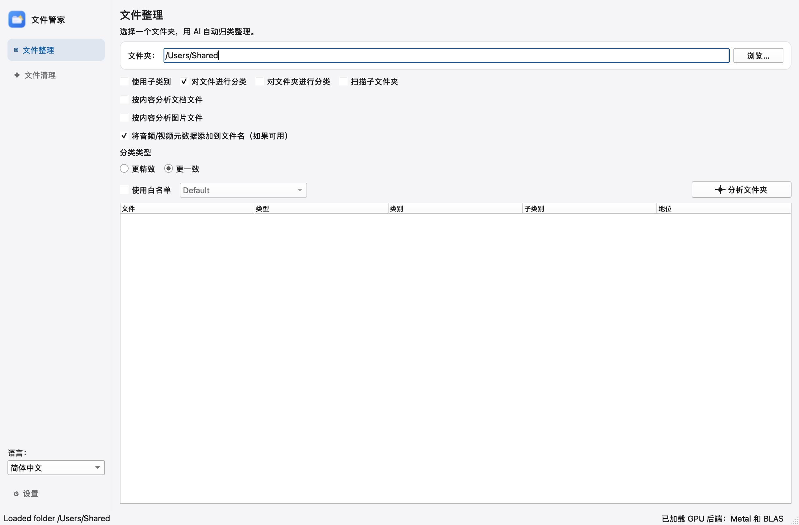
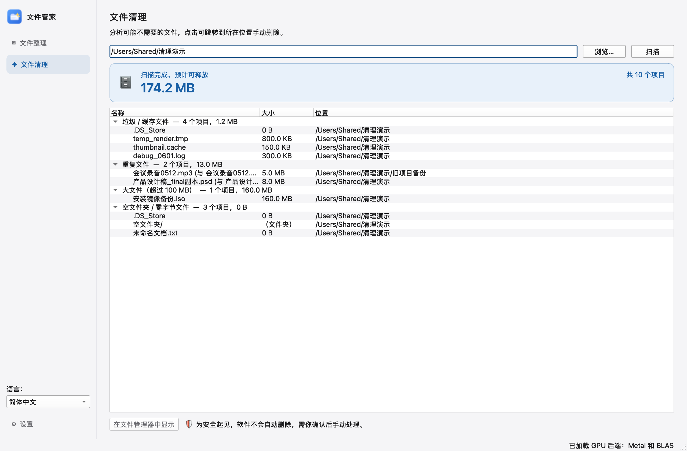

[简体中文](../../README.md) | [English](README.en.md) | [Français](README.fr.md) | [Deutsch](README.de.md) | [Español](README.es.md) | [Italiano](README.it.md) | [Nederlands](README.nl.md) | [한국어](README.ko.md) | [हिन्दी](README.hi.md) | [Türkçe](README.tr.md) | [Svenska](README.sv.md) | [Norsk](README.no.md) | [Dansk](README.da.md) | **Suomi** | [Íslenska](README.is.md)

# File Butler (文件管家)

Anna tekoälyn järjestää sotkuiset kansiosi ja löytää siivoamisen arvoiset tiedostot. Tukee **macOS:ää ja Windowsia**, toimii täysin ilman verkkoyhteyttä.


---

## 📸 Screenshots

| Organize | Clean up |
| --- | --- |
|  |  |

## ✨ Kaksi ydintoimintoa

### 🗂️ Tiedostojen järjestäminen
Valitse kansio: tekoäly ymmärtää jokaisen tiedoston (ei katso vain tiedostonimeä) ja ehdottaa automaattisesti luokkia ja merkityksellisempiä tiedostonimiä:

- **Paikalliset tekoälymallit** (Gemma 3 4B ym.): täysin offline, ilmaisia, tiedostoja ei lähetetä minnekään — yksityisyys turvattu
- Myös pilvi-API:t kuten ChatGPT / Gemini ovat käytettävissä (oma avain tarvitaan)
- **Esikatselu ja vahvistus** ennen järjestämistä, **harjoitustila** (näe tulos koskematta tiedostoihin) ja **kumoa**-toiminto
- Luo oletuksena vain yhden tason luokkakansioita, mikä estää kansioiden pirstaloitumisen

### 🧹 Tiedostojen siivous
Skannaa kansion ja luokittelee neljä «mahdollisesti tarpeetonta» tiedostotyyppiä:

| Luokka | Kuvaus |
|------|------|
| Roska- / välimuistitiedostot | `.tmp` `.log` `.cache` `.DS_Store` `Thumbs.db` jne. |
| Kaksoiskappaleet | Sisällöltään täysin identtiset tiedostot (hash-vertailu), ylimääräiset kopiot merkitään |
| Suuret tiedostot | Yli 100 Mt:n tiedostot, kokojärjestyksessä |
| Tyhjät kansiot / nollatavuiset tiedostot | Tyhjät hakemistot ja tiedostot, joiden koko on 0 |

**🛡 Turvallisuuslupaus: työkalu vain laskee ja paikantaa — se ei koskaan poista tai siirrä mitään.** Jokaisesta kohteesta pääset yhdellä napsautuksella sen sisältävään kansioon, jotta voit itse varmistaa ja poistaa käsin.

---

## 📥 Lataus ja asennus

### macOS (Apple Silicon)
1. Lataa `.dmg` [Releases](https://github.com/echoyu1025-a11y/file-butler/releases)-sivulta
2. Avaa se ja vedä sovellus «Ohjelmat»-kansioon
3. Jos ensimmäinen käynnistys estetään: **napsauta sovellusta hiiren oikealla → Avaa** (sovellusta ei ole notarisoitu Applen toimesta)

### Windows
- Lataa `file-butler-windows`-artefakti viimeisimmästä onnistuneesta käännöksestä [Actions](https://github.com/echoyu1025-a11y/file-butler/actions)-sivulta
mukaan

---

## 🚀 Käyttöönotto kolmessa vaiheessa

1. **Määritä malli** (vain ensimmäisellä kerralla): valitse paikallinen LLM (suositus — ilmainen ja offline) ja lataa se, tai syötä ChatGPT- / Gemini-API-avain
2. **Järjestä**: valitse sivupalkista «Tiedostojen järjestäminen» → valitse kansio → napsauta «Analysoi kansio» → vahvista jokainen luokka → suorita
3. **Siivoa**: valitse sivupalkista «Tiedostojen siivous» → valitse kansio → skannaa → käy läpi neljä tulosryhmää → napsauta siirtyäksesi kunkin tiedoston sijaintiin ja käsittele se itse

Voit vaihtaa käyttöliittymän kielen (15 kieltä) milloin tahansa oikeasta alakulmasta; luokkien kieli seuraa automaattisesti käyttöliittymän kieltä.

---

## 🎨 Tämän laitoksen muutokset alkuperäiseen verrattuna

- Täysin uusi vasemman sivupalkin asettelu (kaksi sivua: Järjestäminen / Siivous) + vaalea valkoinen teema
- Täysin uusi sovelluskuvake
- Uusi vain luku -tilassa toimiva «Tiedostojen siivous» -skannaus (ei alkuperäisessä)
- Käyttöliittymän kieli ja tekoälyluokkien tulostuskieli yhdistetty yhdeksi asetukseksi, oletuksena yksinkertaistettu kiina
- Luokittelun rakeisuus optimoitu: oletuksena yksitasoiset luokkakansiot, kehotteet pakottavat yhdistämisen yleisiin pääluokkiin
- Täydellinen yksinkertaistetun kiinan lokalisointi

## 🔧 Kääntäminen lähdekoodista

Pikaversio macOS:lle:

```bash
brew install qt curl jsoncpp sqlite openssl fmt spdlog mediainfo cmake git pkgconfig libffi
git clone --recursive https://github.com/echoyu1025-a11y/file-butler.git
cd file-butler
cmake -S external/libzip -B external/libzip/build -DBUILD_SHARED_LIBS=OFF -DBUILD_DOC=OFF \
  -DENABLE_BZIP2=OFF -DENABLE_LZMA=OFF -DENABLE_ZSTD=OFF -DENABLE_OPENSSL=OFF \
  -DENABLE_GNUTLS=OFF -DENABLE_MBEDTLS=OFF -DENABLE_COMMONCRYPTO=OFF -DENABLE_WINDOWS_CRYPTO=OFF
cmake --build external/libzip/build
./app/scripts/build_llama_macos.sh --arm64
cd app && make -j8 && ./bin/aifilesorter
```

